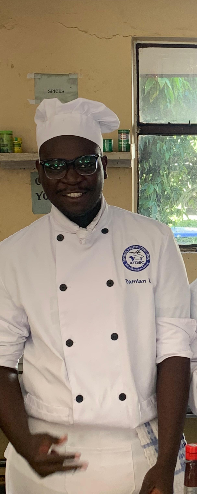

<!DOCTYPE html>
<html lang="en">
<head>
    <meta charset="UTF-8">
    <meta name="viewport" content="width=device-width, initial-scale=1.0">
    <title>Invitation to Chef Damian's Graduation</title>
    
    
    <link rel="stylesheet" href="https://cdnjs.cloudflare.com/ajax/libs/font-awesome/6.4.0/css/all.min.css">
    
</head>
<body class="bg-slate-900 min-h-screen flex items-center justify-center p-4">

    

        
        <!-- Graduation Hat Icon -->
        
🎓

        

            <!-- Header -->
            

                

                    <i class="fas fa-bell text-4xl text-amber-500"></i>
                

                <h2 class="text-slate-700 font-semibold tracking-widest mt-6 uppercase text-sm">You Are Invited To</h2>
            

            <!-- Main Content -->
            

                <h1 class="text-3xl font-bold text-slate-800 text-center mb-2">Chef Damian's</h1>
                
Graduation

                <!-- Added Photo -->
                

                    
                

                <!-- Details -->
                

                    

                        <i class="fas fa-calendar-alt text-amber-500 w-6"></i>
                        <strong>Date:</strong> Friday, July 10, 2026
                    

                    

                        <i class="fas fa-clock text-amber-500 w-6"></i>
                        <strong>Time:</strong> 08:00 AM EAT
                    

                    

                        <i class="fas fa-map-marker-alt text-amber-500 w-6"></i>
                        <strong>Location:</strong> Taita Taveta National Polytechnic, Main Campus, Voi
                    

                    

                        <i class="fas fa-award text-amber-500 w-6"></i>
                        <strong>Achievement:</strong> Food and beverage production (Culinary Arts)
                    

                

                <!-- Video Section -->
                

                    <video controls class="w-full h-auto">
                        <source src="cooking-video.mp4" type="video/mp4">
                        Your browser does not support the video tag.
                    </video>
                

                <!-- Message Card -->
                

                    <h3 class="font-bold text-amber-900 mb-2"><i class="fas fa-graduation-cap mr-2"></i>To Our Favorite Chef! <i class="fas fa-party-horn ml-1"></i></h3>
                    
"Your incredible dedication, flavor, and culinary artistry have brought you to this spectacular milestone! We are immensely proud of your hard work. May your kitchen always be warm, your plates flawlessly crafted, and your future filled with endless success! 👨‍🍳🔥🥂🌟"

                

                <!-- CTA -->
                <button onclick="sendWhatsApp()" class="w-full bg-green-500 hover:bg-green-600 text-white font-bold py-4 rounded-xl transition duration-300 shadow-lg transform hover:scale-[1.02]">
                    Send Congratulations
                </button>
            

        

    

    
</body>
</html>
